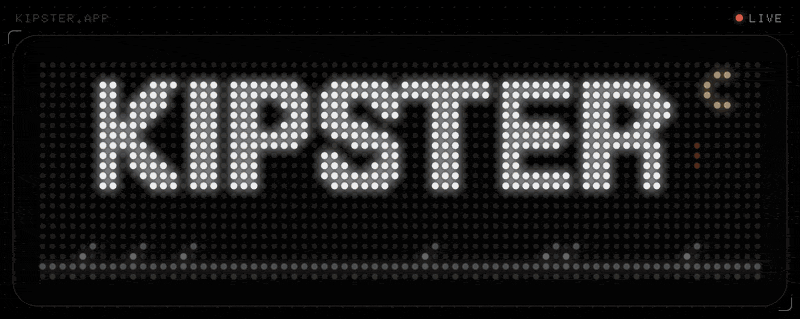
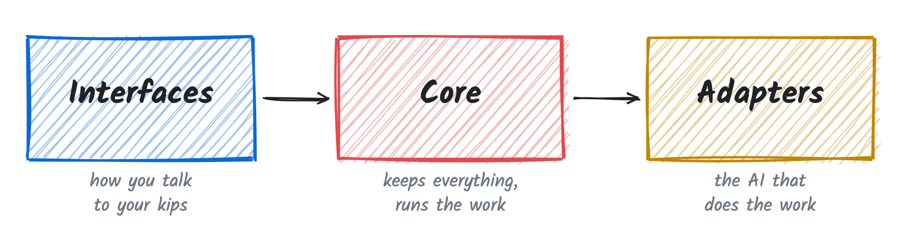
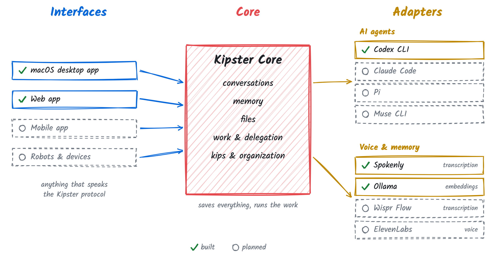

  

  <b>Personal kips that run on your own computer.</b> 
  They remember, plan and handle the busywork.

  <a href="https://kipster.app">kipster.app</a> ·
  <a href="https://kipster.app/media/kipster-film.mp4">Watch the film (0:58)</a>

## What is Kipster

Kipster gives you a small team of AI agents called kips. Kip, your admin, is your
one point of contact: it knows what's going on and runs your other kips. Each kip
keeps its own conversations, memory and files, and all of it stays on your computer.

## How it works

<picture>
  <source media="(prefers-color-scheme: dark)" srcset="docs/assets/how-it-works-dark.png">
  
</picture>

- **Interfaces** are how you talk to your kips.
- **Core** keeps everything: conversations, memory, files, work and your kips.
- **Adapters** connect Core to the AI providers that do the work.

The three parts are independent. Any interface that speaks the Kipster protocol
can talk to Core, and any provider with an adapter can do the work.

<picture>
  <source media="(prefers-color-scheme: dark)" srcset="docs/assets/architecture-dark.png">
  
</picture>

## Status

Early development. Not yet a supported release. Setup instructions are coming soon.

## Repository

| Folder | What it holds |
| --- | --- |
| [`core/`](core) | Core, the Kipster protocol and the adapter contract |
| [`interface/`](interface) | The Kipster app for macOS and the web |
| [`adapters/`](adapters) | Provider adapters: Codex CLI, Spokenly, Ollama |
| [`docs/`](docs) | Architecture, design decisions and [releasing](docs/releasing.md) |

## License

[Apache-2.0](LICENSE)
